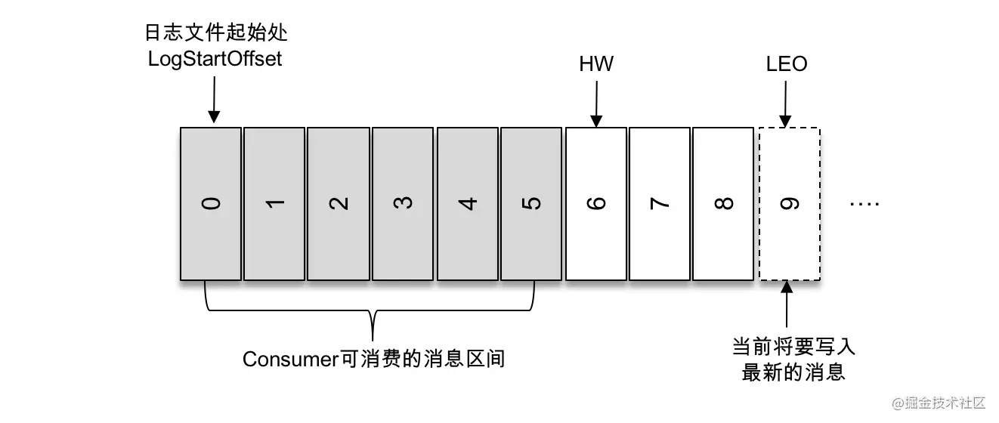

# Kafka 常见面试题

## 1. Kafka是什么

Kafka 起初是 由 LinkedIn 公司采用 Scala 语言开发的一个**多分区**、**多副本**且基于 **ZooKeeper** 协调的分布式消息系统。

现已被捐献给 Apache 基金会。目前 Kafka 已经定位为一个 **事件流** 平台，具有分布式、高度可扩展、弹性、容错和安全等特性

## 2. Kafka 可以做什么

- **消息系统**： Kafka 和传统的消息系统（也称作消息中间件）都具备系统解耦、冗余存储、流量削峰、缓冲、异步通信等功能。与此同时，Kafka 还提供了大多数消息系统难以实现的**消息顺序性保障**及**回溯消费**的功能。与大多数消息传递系统相比，**Kafka 具有更好的吞吐量、内置的分区、复制和容错能力**，这使其成为大规模消息处理应用程序的良好解决方案。
- **存储系统**： Kafka 把消息持久化到磁盘，相比于其他基于内存存储的系统而言，有效地降低了数据丢失的风险。也正是得益于 Kafka 的消息持久化功能和多副本机制，我们可以把 Kafka 作为长期的数据存储系统来使用，只需要把对应的数据保留策略设置为“永久”或启用主题的日志压缩功能即可。
- **流式处理平台**： Kafka 不仅为每个流行的流式处理框架提供了可靠的数据来源，还提供了一个完整的流式处理类库，比如窗口、连接、变换和聚合等各类操作。

> 主题中的事件可以根据需要随时读取——与传统的消息传递系统不同，事件在消费后不会被删除。相反，您可以通过每个主题的配置设置来定义 Kafka 应该将您的事件保留多长时间，之后旧事件将被丢弃。Kafka 的性能在数据大小方面实际上是恒定的，因此长时间存储数据是非常好的。

kafka是一个分布式事件流系统，由通过高性能TCP网络协议 进行通讯的服务器和客户端组成。
## 4. kafka中的ISR、AR代表什么，ISR伸缩又指什么？

- ISR（in sync replicas）所有与 leader 副本保持**一定程度同步**的副本，包括leader副本
- AR （assigned replicas） 分区中所有副本
- OSR （out sync replicas） 与 leader 副本同步的**滞后过多**的副本。

> leader 副本负责维护和跟踪 ISR 集合中所有 follower 副本的滞后状态，当 follower 副本落后太多或失效时，leader 副本会把它从 ISR 集合中剔除。如果 OSR 集合中有 follower 副本“追上”了 leader 副本，那么 leader 副本会把它从 OSR 集合转移至 ISR 集合。
> 
> **默认情况下**，当 leader 副本发生故障时，只有在 ISR 集合中的副本才有资格被选举为新的 leader。（不过这个原则也可以通过修改相应的参数配置来改变）

前面所说的“一定程度的同步”是指可忍受的滞后范围，这个范围可以通过参数 `replica.lag.time.max.ms` 进行配置

ISR 与 **HW** 和 **LEO** 也有紧密的关系。HW 是 High Watermark 的缩写，俗称高水位，它标识了一个特定的消息偏移量（offset），消费者只能拉取到这个 offset 之前的消息。

如上图所示，它代表一个日志文件，这个日志文件中有9条消息，第一条消息的 offset（LogStartOffset）为0，最后一条消息的 offset 为8，offset 为9的消息用虚线框表示，代表下一条待写入的消息。日志文件的 HW 为6，表示消费者只能拉取到 offset 在0至5之间的消息，而 offset 为6的消息对消费者而言是不可见的。

**LEO 是 Log End Offset 的缩写**，它标识当前日志文件中下一条待写入消息的 offset，上图中 offset 为9的位置即为当前日志文件的 LEO，LEO 的大小相当于当前日志分区中最后一条消息的 offset 值加1。分区 ISR 集合中的每个副本都会维护自身的 LEO，而 **ISR 集合中最小的 LEO 即为分区的 HW**，对消费者而言只能消费 HW 之前的消息。

## 5. kafka 中的broker是什么

broker 是消息的代理，Producers往Brokers里面的指定Topic中写消息，Consumers从Brokers里面拉取指定Topic的消息，然后进行业务处理，broker在中间起到一个代理保存消息的中转站。

## 6. kafka 中的zookeeper起到什么作用？可以不用吗

zookeeper是一个分布式协调组件。目前kafka用zk做meta信息存储，consumer的消费状态，group的管理以及 offset 的值。未来将不依赖zk

## 7. kafka follower如何与leader保持同步

Kafka 的复制机制**既不是完全的同步复制，也不是单纯的异步复制**。事实上，同步复制要求所有能工作的 follower 副本都复制完，这条消息才会被确认为已成功提交，这种复制方式极大地影响了性能。而在异步复制方式下，follower 副本异步地从 leader 副本中复制数据，数据只要被 leader 副本写入就被认为已经成功提交。在这种情况下，如果 follower 副本都还没有复制完而落后于 leader 副本，突然 leader 副本宕机，则会造成数据丢失。

Kafka 使用的这种 **ISR** 的方式则有效地权衡了数据可靠性和性能之间的关系

follower可以**批量的**从leader复制数据，而leader顺序以及send file（**zero copy**）机制，这样极大的提升复制性能，内部批量写磁盘，大幅减小follower与leader的消息量差

## 8. 什么情况下 broker 会从 ISR 中踢出去

leader会动态维护一个与其基本保持同步的Replica列表，这个列表称为ISR。每个partition都有一个isr，如果follower落后于leader太多就会被提出Isr。另外leader所在节点挂了，也是从isr中选举新的leader。

判断落后的指标配置中的参数是：`replica.lag.time.max.ms`

## 9. kafka producer 如何优化写入速度

- 增加线程
- 提高 batch.size
- 增加更多 producer 实例
- 增加 partition 数
- 设置 acks=-1 时，如果延迟增大：可以增大 num.replica.fetchers（follower 同步数据的线程数）来调解；
- 跨数据中心的传输：增加 socket 缓冲区设置以及 OS tcp 缓冲区设置。

## 10. kafka producer 打数据，ack 为 0， 1， -1 的时候代表啥

-  1 （默认） 数据发送到kafka后，只需要经过leader副本确认成功接收。这种情况leader副本commit后宕机，而follower未同步，就会丢失数据
-  0 生产者发送消息无需确认，这种情况数据传输消息最高，同时可靠性也是最低的
-  -1 或 all 生产者需要等待ISR中所有副本向leader发送ACK确认接收，leader才会commit，这样可靠性最高。**但这并不意味着消息就一定可靠**，因为ISR中可能只有 leader 副本，这样就退化成了 acks=1 的情况。要获得更高的消息可靠性需要配合 `min.insync.replicas` 等参数的联动，

## 11. kafka unclean配置代表什么，会对spark streaming有何影响

`unclean.leader.election.enable` 为true的话，以为这非ISR副本也可以参与选举，这样可能造成数据丢失。spark streaming在消费过程中拿到的 log end offset 会突然变小，导致 spark streaming job挂掉。

## 12. 如果发生leader crash时，ISR为空怎么办
默认情况下，会一直等待leader恢复。

kafka在Broker端提供了一个配置参数：`unclean.leader.election.enable`，这个参数有两个值，默认是false。如果改为true则OSR副本也可以参与选举，但可能会造成数据不一致，降低可靠性。

## 13. kafka的message格式是什么
一个kafka messgae由一个固定长度的header和一个变长的消息体构成body。

header的部分由一个字节的magic（文件格式）和4个字节的CRC32(用于判断body消息体是否正常)构成。

当magic为1时，会在magic和crc32之间多一个字节的数据：attributes(保存一些相关属性，比如是否压缩、压缩格式等)；如果magic为0，则不存在attributes。

消息体body包含key、value、timestamp

## 14. kafka中的consumer group是什么
consumer group 是逻辑上的概念，是kafka实现单播和广播消息模型的手段。同一个topic的数据会被广播给所有订阅的group，一个group内只有一个consumer worker可以获得这个数据。worker的数量不要超过partitions数量，且最好保持整数倍关系，否则多出来的consumer会闲置。

## 15. kafka 预防消息丢失

kafka消息是否会丢失要从两个方面入手：消息发送和消息消费

1. 消息发送

> 发送消息主要有三种模式：发后即忘（fire-and-forget）、同步（sync）及异步（async）。
>
> kafka 生产者参数 `request.required.acks` 这个参数用来指定分区中必须要有多少个副本收到这条消息，之后生产者才会认为这条消息是成功写入的

ack=0 表示无需确认；ack=1 表示只需要leader副本确认；ack=-1 表示需要ISR的所有副本都接手成功。可见配置0和1都可能出现消息丢失，同时要注意配置 `min.insync.replicas` 要大于 1，否则会退化为ack=1的情况

2. 消息消费

消费者有两个consumer接口，Low-Level API 和 High-Level API:

  - Low-Level API： 消费者自己维护offset等值，可以实现对kafka完全控制
  - High-Level API：封装了对parition和offset的管理，使用简单；
  
  使用High-Level API，可能出现的问题是，当消费者从kafka中取出消息，并提交新的offset后，还没来得及消费就挂掉了，那么就造成了数据丢失。（此时数据并没有真的消失，而是消费位移忽略了它）
  
## 16. kafka 消息顺序性

> 一般而言，在需要保证消息顺序的场合建议把参数 `max.in.flight.requests.per.connection`配置为1，而不是把 `retries` 配置为0，不过这样也会影响整体的吞吐。

## 17. kafka 为什么不支持读写分离

在kafka中，producer 写入消息和 consumer 读取消息都是与 leader 副本进行交互的。

旧版的kafka不支持读写分离，因为：
1. 数据不一致，因为 kafka 不是完全同步复制，也不是单纯的异步复制，而是基于ISR有限度的复制，允许follower与leader有一定的数据不一致
2. 没有必要。读写分离适用的场景是，低写高读的场景，避免写操作加锁影响读操作。而事件流不存在这种问题，因为数据写入后的offset是固定的，不存在加锁问题，生产者与消费者没有干扰

## 18. kafka怎么体现消息有序性

kafka每个partition中的消息在写入时都是有序的，消费时，每个partition中的消息只会被consumer group中的一个消费者消费，保证了消费的有序性。

整个topic不保证有序性，如果为了保证整个topic有序，那么partition个数调整为1

## 19. 消费者提交消费位移时提交的是当前消费到的最新消息的offset还是offset+1?

offset+1

## 20. kafka如何实现延迟队列

Kafka并没有使用JDK自带的Timer或者DelayQueue来实现延迟的功能，而是基于时间轮自定义了一个用于实现延迟功能的定时器（SystemTimer）。JDK的Timer和DelayQueue插入和删除操作的平均时间复杂度为O(nlog(n))，并不能满足Kafka的高性能要求，而基于时间轮可以将插入和删除操作的时间复杂度都降为O(1)。时间轮的应用并非Kafka独有，其应用场景还有很多，在Netty、Akka、Quartz、Zookeeper等组件中都存在时间轮的踪影。

底层使用数组实现，数组中的每个元素可以存放一个TimerTaskList对象。TimerTaskList是一个环形双向链表，在其中的链表项TimerTaskEntry中封装了真正的定时任务TimerTask.

Kafka中到底是怎么推进时间的呢？Kafka中的定时器借助了JDK中的DelayQueue来协助推进时间轮。具体做法是对于每个使用到的TimerTaskList都会加入到DelayQueue中。Kafka中的TimingWheel专门用来执行插入和删除TimerTaskEntry的操作，而DelayQueue专门负责时间推进的任务。再试想一下，DelayQueue中的第一个超时任务列表的expiration为200ms，第二个超时任务为840ms，这里获取DelayQueue的队头只需要O(1)的时间复杂度。如果采用每秒定时推进，那么获取到第一个超时的任务列表时执行的200次推进中有199次属于“空推进”，而获取到第二个超时任务时有需要执行639次“空推进”，这样会无故空耗机器的性能资源，这里采用DelayQueue来辅助以少量空间换时间，从而做到了“精准推进”。Kafka中的定时器真可谓是“知人善用”，用TimingWheel做最擅长的任务添加和删除操作，而用DelayQueue做最擅长的时间推进工作，相辅相成。
