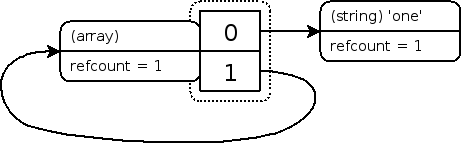

# PHP垃圾回收机制

- [引用计数](https://www.php.net/manual/zh/features.gc.refcounting-basics.php)
- [回收循环](https://www.php.net/manual/zh/features.gc.collecting-cycles.php)

## 引用计数基础
> php变量存储在"**zval**"容器中。zval 容器除了变量的类型和值之外，还包含两个额外的信息位。**第一个是“is_ref”，是布尔值，表示变量是否是“引用集合”的一部分**。通过这个位，PHP 引擎知道如何区分普通变量和引用。**第二个是“refcount”，表示有多少个变量名（也称为符号）指向这个 zval 容器**。所有符号都存储在一个符号表中，**每个作用域都有一个符号表**。主脚本（即通过浏览器请求的脚本）有一个作用域，每个函数或方法也有一个作用域。


> 如果没有创建用户定义的引用，`is_ref`默认是false。请注意，具有“refcount”为 1 的引用（即"is_ref"为 true）会视为非引用（即“is_ref”为 false）。

存在循环引用的问题
```php
$a = array( 'one' );
$a[] =& $a;
xdebug_debug_zval( 'a' );
```


再清除$a
```php
unset($a)
```


> 此时，虽然在任何作用域中都没有指向这个结构的符号，却无法清理它，因为数组元素“1”仍然指向同一个数组。**由于没有外部符号指向它，用户无法清理该结构**；因此会出现内存泄漏。

## 回收循环
解决引用计数无法回收循环引用的问题（一种标记清除算法）

### 回收过程

如果变量的 refcount 减小后大于 0，PHP 并不会立即对这个变量进行垃圾鉴定和回收，而是放入一个缓冲区中，等这个缓冲区满了以后 (10000 个值) 再统一进行处理。

处理方式就是进行可达性分析，