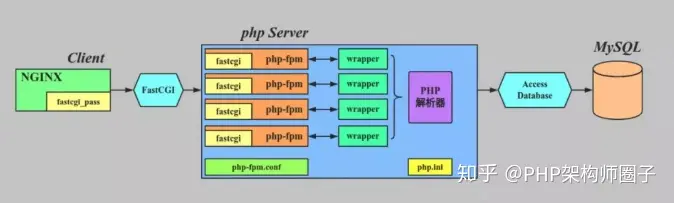

# nginx与php之间的通信过程

常见的lnmp架构中，nginx与php的通信是最重要的一环

我需要先了解几个关键名词

1.  CGI 通用网关协议，很明显CGI是一个协议，不是进程
2.  FastCGI 快速通用网关接口，是CGI的优化
3.  PHP-CGI 是php解释器，他是一个CGI程序，本身只能解析请求，不能管理进程。
4.  PHP-FPM： php-fpm 是`php-fastcgi`的进程管理器，有一个master进程和多个worker进程，master与web服务器进行通信，接收请求，再将请求交给woker进程处理
## nginx+FastCGI的工作过程

nginx与php通信的桥梁是php-fpm

1. 当nginx收到http动态请求，会初始化fastCGI环境。
2. nginx采用socket的方式转给fastCGI
3. fastCGI主进程监听到请求，选择一个空闲的woker进程连接，nginx将CGI环境变量和标准输入发送给改woker进程
4. woker进程处理完后将标准输出和错误信息从同一个socket连接返回给nginx
5. woker进程关闭连接，等待一下请求

## php-fpm详解

PHP-FPM(PHP FastCGI Process Manager)意：PHP FastCGI 进程管理器，用于管理PHP 进程池的软件，用于接受web服务器的请求。PHP-FPM提供了更好的PHP进程管理方式，可以有效控制内存和进程、可以平滑重载PHP配置。

1. 为什么会出现php-fpm

fpm的出现是因为php-fastcgi出现，为了很好的管理php-fastcgi而实现的一个程序。

2. 什么是php-fastcgi

php-fastcgi 只是一个cgi程序,只会解析php请求，并且返回结果，不会管理(因此才出现的php-fpm)。

3. 为什么不叫php-cgi

其实在php-fastcgi出现之前是有一个php-cgi存在的,只是它的执行效率低下，因此被php-fastcgi取代。

4. fastcgi和cgi有什么区别这区别就大了，当一个服务web-server(nginx)分发过来请求的时候，通过匹配后缀知道该请求是个动态的php请求，会把这个请求转给php。在cgi的年代，思想比较保守，总是一个请求过来后,去读取php.ini里的基础配置信息，初始化执行环境，每次都要不停的去创建一个进程,读取配置，初始化环境，返回数据，退出进程，久而久之，启动进程的工作变的乏味无趣特别累。当php来到了5的时代，大家对这种工作方式特别反感，想偷懒的人就拼命的想，我可不可以让cgi一次启动一个主进程(master),让他只读取一次配置，然后在启动多个工作进程(worker),当一个请求来的时候，通过master传递给worker这样就可以避免重复劳动了。于是就产生了fastcgi

参考资料
> [PHP架构师之路](https://zhuanlan.zhihu.com/p/403668146)
