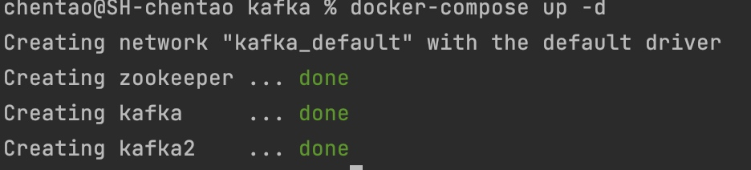
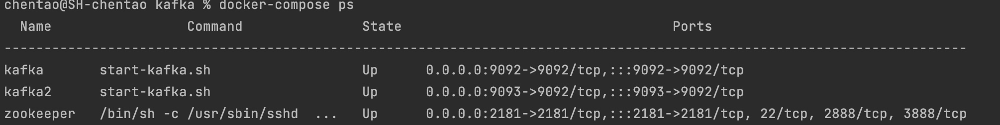
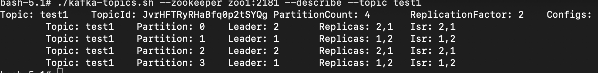

# docker 部署kafka
> 参考：https://github.com/wurstmeister/kafka-docker
## 1. 部署kafka

### 1. 准备基础镜像
```bash
docker pull wurstmeister/zookeeper
docker pull wurstmeister/kafka
```
### 2. 快速开始

启动zookeeper
```
docker run -d --name zookeeper --publish 2181:2181 \
--volume /etc/localtime:/etc/localtime \
--restart=always \
wurstmeister/zookeeper
```

启动kafka
```
docker run -d --name kafka --publish 9082:9092 \
--link zookeeper:zookeeper \
--env KAFKA_BROKER_ID=100 \
--env HOST_IP=192.168.1.108 \
--env KAFKA_ZOOKEEPER_CONNECT=zookeeper:2181 \
--env KAFKA_ADVERTISED_HOST_NAME=192.168.1.108 \
--env KAFKA_ADVERTISED_PORT=9082 \
--restart=always \
--volume /etc/localtime:/etc/localtime \
wurstmeister/kafka
```

启动kafka-manager
```bash
docker run -d --name kafka-manager \
--link zookeeper:zookeeper \
--link kafka:kafka \
-p 9001:9000 \
--restart=always \
--env ZK_HOSTS=zookeeper:2181 \
sheepkiller/kafka-manager
```

访问kafka-manager
http://127.0.0.1:9001

### 2. docker-compose 部署

创建一个目录保存 docker-compose.yml，其内容如下

`mkdir ~/docker/kafka && touch docker-compose.yml`

```yml
# docker-kafka

# 启动 docker-compose -f docker-compose.yml up

version: "3"
services:
  zoo1:
    image: wurstmeister/zookeeper
    restart: unless-stopped # 当发生错误时重启
    hostname: zoo1
    ports:
      - "2181:2181"
    container_name: zookeeper # 指定容器名，否则默认名：

  kafka1:
    image: wurstmeister/kafka
    ports:
      - "9092:9092"
    environment:
      KAFKA_ADVERTISED_HOST_NAME: 10.241.122.251
      KAFKA_ZOOKEEPER_CONNECT: "zoo1:2181"
      KAFKA_BROKER_ID: 1
      KAFKA_OFFSETS_TOPIC_REPLICATION_FACTOR: 1
      # 默认创建的topic
      KAFKA_CREATE_TOPICS: "stream-in:1:1,stream-out:1:1"
    volumes:
      - ./data/kafka1/data:/data
      - ./data/kafka1/log:/datalog
    depends_on:
      - zoo1
    container_name: kafka1

  kafka2:
    image: wurstmeister/kafka
    ports:
      - "9093:9092"
    environment:
      # ipconfig getifaddr en0 指令的结果
      KAFKA_ADVERTISED_HOST_NAME: 10.241.122.251
      KAFKA_ADVERTISED_PORT: 9093
      KAFKA_ZOOKEEPER_CONNECT: "zoo1:2181"
      KAFKA_BROKER_ID: 2
      KAFKA_OFFSETS_TOPIC_REPLICATION_FACTOR: 1
    volumes:
      - ./data/kafka1/data:/data
      - ./data/kafka1/log:/datalog
    depends_on:
      - zoo1
    container_name: kafka2
```

### 3. 创建并启动docker-kafka镜像 
`docker-compose up -d`



至此一个简单的kafka集群就部署好了

## 2. 测试kafka

1. 查看运行中的容器 
`docker-compose ps`




2. 进入到容器 kafka1 中 
`docker exec -it kafka1 bash`

### 1. 创建 topic
```bash
#单机
# $KAFKA_HOME/bin/kafka-topics.sh --create --partitions 1 --replication-factor 2 --topic test --bootstrap-server localhost:9092
#集群
$KAFKA_HOME/bin/kafka-topics.sh --create --partitions 4 --replication-factor 2 --topic test --zookeeper zoo1:2181
```

注意: 
- `--topic` 后面是topic的名字
- `--zookeeper` 后面是zookeeper的容器的hostname，如果没有设置hostname则是container-name
- `--replication-factor` 表示该topic需要在不同的broker中保存几份, `partitions` 为几个分区

### 2. 查看topic列表
```bash
# $KAFKA_HOME/bin/kafka-topics.sh --list --bootstrap-server localhost:9092

$KAFKA_HOME/bin/kafka-topics.sh --list --zookeeper zoo1:2181
```

### 3. 查看topic详情

```bash
# $KAFKA_HOME/bin/kafka-topics.sh --describe --topic test --bootstrap-server localhost:9092

$KAFKA_HOME/bin/kafka-topics.sh --describe --topic test --zookeeper zoo1:2181 
```


 - Topic: 表示主题名，
 - Partition: 表示分区号，
 - Leader表示分区的Leader副本所对应的brokerid，
 - Replicas：表示分区的所有副本分配情况，Isr表示ISR集合。

如上图：主题 test1，有4个分区，每个分区有2个副本（包括leader副本），分布在2个broker上。分区号分别是0，1，2，3。其中分区0的Leader副本在id为1的broker上，另一个副本在brokerid=2的节点上。
### 4. 启动 producer 发布消息
```bash
$KAFKA_HOME/bin/kafka-console-producer.sh --topic test --broker-list kafka1:9092

#$KAFKA_HOME/bin/kafka-console-producer.sh --topic test --bootstrap-server localhost:9092
```
### 5. 启动consumer 接收消息
```bash
$KAFKA_HOME/bin/kafka-console-consumer.sh --topic test --bootstrap-server kafka1:9092 --from-beginning
```

### 6. kafka-manager
```
docker run -itd --name=kafka-manager -p 9000:9000 -e ZK_HOSTS="10.241.122.251:2181" sheepkiller/kafka-manager
```

