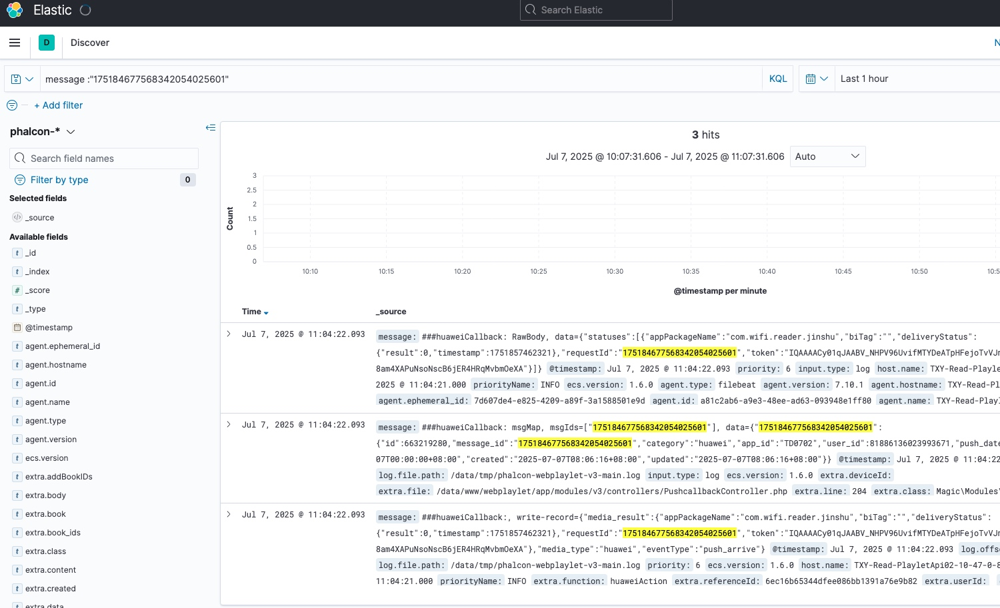

## 为了方便实验，我们用docker搭建一台nginx服务器
```
git clone https://github.com/spujadas/elk-docker.git
```

## 在本地创建 nginx.conf 和 log目录
1. 切换到home目录 `cd`
2. 在该目录下创建 `mkdir nginx`
3. 进入nginx目录 `cd nginx`
4. 创建nginx.conf文件 `vim nginx.conf`，文件内容如下

注意重点，我们将access.log的日志格式化成了json格式
```
user  nginx;
worker_processes  auto;

error_log  /var/log/nginx/error.log notice;
pid        /var/run/nginx.pid;


events {
    worker_connections  1024;
}


http {
    include       /etc/nginx/mime.types;
    default_type  application/octet-stream;

    log_format json '{"@timestamp":"$time_iso8601",'
                    '"@version":1,'
                    '"host":"$server_addr",'
                    '"client":"$remote_addr",'
                    '"size":$body_bytes_sent,'
                    '"responsetime":$request_time,'
                    '"domain":"$host",'
                    '"url":"$uri",'
                    '"status":"$status"}';

    access_log  /var/log/nginx/access.log  json;

    sendfile        on;
    #tcp_nopush     on;

    keepalive_timeout  65;

    #gzip  on;

    include /etc/nginx/conf.d/*.conf;
}
``` 

6. 创建 log目录 和相关文件  
```
mkdir log 
cd log
touch access.log error.log
```
## 启动nginx
```
docker run -it -d --name nginx-filebeat -p 80:80 \
-v ~/nginx/nginx.conf:/etc/nginx/nginx.conf \
-v ~/nginx/log:/var/log/nginx \
nginx-filebeat:1.2
```
我们将容器内的nginx.conf文件和log目录挂载在了本地，并映射本地80端口给容器的80端口

访问127.0.0.1 一下试试

才看一下access.log的日志有没有变化`tail -f ~/nginx/log/access.log`


## logstash配置
主要有三个地方要处理，首先是输入源在什么位置，然后是对数据进行过滤或者格式化，最后是需要将数据输出到什么地方；在下方的配置只做了其中两项，编辑配置文件命令参考如下：
在本地创建一个配置文件`vim ~/docker/elk-data/conf/test.conf`

下面是test.conf的内容
```
input {
    file {
        path => "/opt/logs/access.log"  # 填写容器内部log文件路径
        codec => "json"
    }
}
output {
    elasticsearch { 
        hosts => ["127.0.0.1:9200"] 
    }
    stdout { 
        codec => rubydebug 
    }
}
```

## 启动elk容器
运行此容器的时候，需要将宿主机的端口转发到该容器，其中ES端口为9200，kibana端口为5601，logbate端口为5044；

注意我们将容器内的/var/nginx/log目录挂载到了本地~/nginx/log，这样logstash就可以间接的采集到nginx容器内的日志啦
```bash
docker run -p 5601:5601 -p 9200:9200 -p 5044:5044 
-v ~/nginx/log:/var/nginx/log \  
-v ~/docker/elk-data/conf/test.conf:/opt/conf/test.conf \
-v ~/elk-data/conf:/opt/conf \  
-v ~/elk-data/logs:/opt/logs \
-v ~/elk-data/elasticsearch-data:/var/lib/elasticsearch  
-it -d --name elk sebp/elk:7.13.2
```
## 进入到前面我们启动好的elk容器内
`docker exec -it elk /bin/bash`

删除02-beats-input.conf 关于ssl的三行设置，否则客户端需要另外配置证书相关配置项（每次重新创建容器都需要删除这三行设置）

`vim /etc/logstash/conf.d/02-beats-input.conf`

需要关闭自动开启的 logstash，检查logstash,elasticsearch状态，保持elasticsearch开启，logstash关闭

`service logstash stop`

进入容器之后,需要启动logstash来收集数据，启动的时候需要带两个参数进去，第一个是logstash的数据暂存位置，第二个是使用的配置文件，因此构造的命令如下所示：

`/opt/logstash/bin/logstash -f /opt/conf/test.conf --config.reload.automatic`

看到如下内容表示成功了


再访问一下`127.0.0.1`


让我们来看看kibana上的效果


## elk搜索日志

