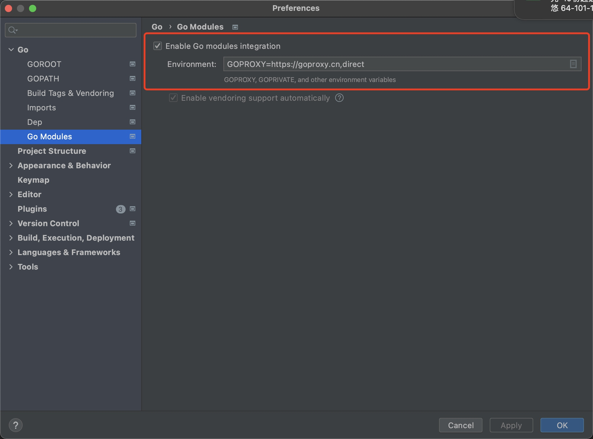

# go 代理 goproxy

因为众所周知的原因，国内直接`go get`会超时，因此需要使用代理。

这里推荐一个代理服务器 [GOPROXY.IO](https://goproxy.io/zh/)

> https://goproxy.io/zh/docs/getting-started.html
### linux OR mac
```
# 配置 GOPROXY 环境变量
export GOPROXY=https://proxy.golang.com.cn,direct
# 还可以设置不走 proxy 的私有仓库或组，多个用逗号相隔（可选）
export GOPRIVATE=git.mycompany.com,github.com/my/private
```

是配置长久有效
```
# 设置你的 bash 环境变量
echo "export GOPROXY=https://proxy.golang.com.cn,direct" >> ~/.profile && source ~/.profile

# 如果你的终端是 zsh (mac)，使用以下命令
echo "export GOPROXY=https://proxy.golang.com.cn,direct" >> ~/.zshrc && source ~/.zshrc
```

检查是否配置成功 `go env`

### goland 配置 goproxy
需要注意的是，如果你用的是编辑工具自带的 Terminal 还需要单独配置goproxy，否则可能`go get`还是会超时

GOPROXY=https://goproxy.io,direct


重启goland