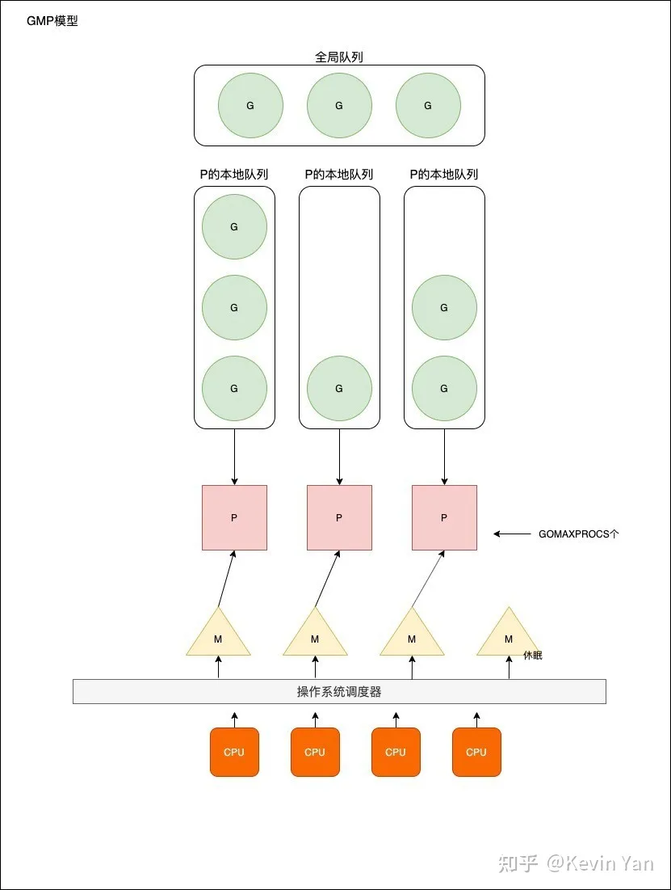

# goroutine学习笔记

## 进程、线程、协程
进程：系统进行资源分配的基本单位，有独立的内存空间

线程：CPU调度和分配资源的基本单位，线程依附于进程，每个线程会共享父进程的资源

协程：一种**用户态的轻量级线程**，协程完全由用户控制，协程间的切换只需要保存任务的上下文，没有内核开销

## 优势
### 内存消耗更小
1. 一个线程可以包含多个协程
2. 线程大约申请8MB内存（线程栈空间通常是 2M）
3. 协程大约4k（Goroutine 栈空间最小 32位系统2K）
### 上线文切换更快
1. 协程少一道手续，协程只涉及到3个寄存器值的修改；而线程需要涉及到模式切换（用户态切换到内核态），以及16个寄存器、PC、SP...等寄存器的修改
2. 线程申请内存，需要走内核；协程申请内存，不需要走内核

**线程上下文切换**，由于中断处理、多任务处理、用户态切换等原因CPU从一个线程切换到另一个线程，需要保存当前线程的状态并恢复到另一个线程的状态。**上下文切换的代价是高昂的**。上下文切换的延迟取决于不同的因素，大概在在 50 到 100 纳秒之间，考虑到硬件在内核上平均每纳秒大约执行12条指令，那么一次上下文切换花费600到1200条指令的执行时间。如果存在**跨核上下文切换**，可能导致CPU缓存失效（CPU从缓存访问数据的成本约3 - 40个时钟周期，从主存访问则是100到300个时钟周期），这中场景的切换成本更高

## G-P-M模型

Go 调度器模型我们通常叫做G-P-M 模型，他包括 4 个重要结构，分别是G、P、M、Schedule

G: Goroutine，每个`Goroutine`对应一个 G 结构体，G 存储Goroutine的运行堆栈、状态以及任务函数，可重用。G并非执行体，每个**G需要绑定到P**才能被调度执行

P：Processor，表示**逻辑处理器**，对G来说，**P相当于CPU核**，G只有绑定P才能被调度执行。对于M来说，P执行了相应的执行环境（context），如内存分配状态（mcache）任务队列（G）等。P的数量决定了系统内最大可执行G的数量（前提CPU核数 >= P数量）。P的数量由用户设置的`GOMAXPROCS`决定，最大为256。

M: Machine, OS内核线程抽象，代表**真正执行计算的资源**，在绑定有效P后，进入 schedule 循环；而P的循环机制大致是从`gobal`队列、P的`local`队列以及`wait`队列获取。**M的数量不是固定的，由go runtime调整**。为了防止过度创建OS线程导致系统调度不过来，目前最大限制为**10000**个。M不保留G状态，这是**G可以跨M调度**的基础。

**注意: 设置 GOMAXPROCS 高于真正可使用的核心数后会导致Go调度器不停地进行OS线程切换，从而给调度器增加很多不必要的工作**。go会获取CPU核心数作为GOMAXPROCS，docker会隔离CPU，导致无法获取到正确的CPU核数，目前 Go 官方并无好的方式来规避在容器里获取不到真正可使用的核心数这一问题，而 Uber 提出了一种 `Workaround` 方法，利用 uber-go/automaxprocs 这一个包，可以在运行时根据 cgroup 为容器分配的CPU资源限制数来修改 GOMAXPROCS。

## 调度过程
go新创建一个groutine，这个G会进入到P的**本地队列**，如果本地队列满了，会将其中一半的G转移到**全局队列**。

P绑定M或新建M，将本地队列中的G分配给M处理，进入调度循环。如果G发生阻塞，会被移入到全局队列中等待。当P本地队列的G都处理完了，会从全局队列中获取一批G，如果全局队列为空，则会使用**work stealing**算法随机的从其他P中获取一半的G到自己本地队列。

通过这种调度机制，go可以高效的利用操作系统资源。

### 减少阻塞
如果正在执行的 Goroutine 阻塞了线程 M 怎么办？P 上 LRQ 中的 Goroutine 会获取不到调度么？

场景 1：由于原子、互斥量或通道操作调用导致 Goroutine 阻塞，调度器将把当前阻塞的 Goroutine 切换出去，重新调度 LRQ 上的其他 Goroutine；

场景 2：由于网络请求和 IO 操作导致 Goroutine 阻塞，这种阻塞的情况下，我们的 G 和 M 又会怎么做呢？

场景 3：当调用一些系统方法的时候，如果系统方法调用的时候发生阻塞，这种情况下，**网络轮询器**（NetPoller）无法使用，而进行系统调用的 Goroutine 将阻塞当前 M。

场景 4：如果在 Goroutine 去执行一个 sleep 操作，导致 M 被阻塞了。

主要说明场景2的情况：
**当出现大量网络请求和IO操作导致Goroutine阻塞，Go提供了网络轮询器（netpoller）来处理网络请求和 IO 操作的问题，通过epoll实现IO多路复用。** 通过使用 NetPoller 进行网络系统调用，调度器可以防止 Goroutine 在进行这些系统调用时阻塞 M。这可以让 M 执行 P 的 LRQ 中其他的 Goroutines，而不需要创建新的 M。有助于减少操作系统上的调度负载

**总之，原理是Go runtime中的netpoller通过非阻塞socket和IO多路复用机制模拟出来，Go中的net库即按照这种方式实现。**
