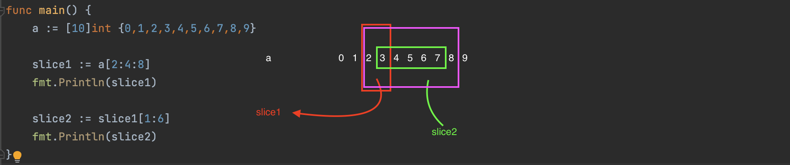

# go的数据类型
https://www.runoob.com/go/go-data-types.html

1. bool 
2. 数字类型，支持整数和浮点数，并且支持复数
3. string 字符串类型
4. 派生类型
    - 指针类型
    - 数组类型
    - 结构化类型
    - channel类型
    - 函数类型
    - 切片类型
    - 接口类型
    - map类型

## 数字类型
整数
| 类型 | 描述    |     
|------|-----|
| uint8、bype  | 无符号8位整型 | 
| uint16 | 无符号16位整型|     
| uint32 | 无符号32位整型|  
| uint64 | 无符号64位整型|  
| int8  | 有符号8位整型 | 
| int16 | 有符号16位整型|     
| int32、rune | 有符号32位整型|  
| int64 | 有符号64位整型|  

浮点数
| 类型 | 描述 |
|---|---|
| float32 | 32位浮点型|
| float64 | 64位浮点型|
| complex32 | 32位的实数和虚数|
| complex64 | 64位的实数和虚数|

## 数组

## slice 切片

go语言切片 slice 是对数组的抽象，可以当成是动态数组，它的长度是不固定的，可以追加元素。

下图展示了切片与数组的关系

注意：切片的底层数数组，做切片时其长度不能超过底层数组的容量。如上图：slice2的可以也只能在slice1的容量范围内切片（可以越过显示的长度）。

