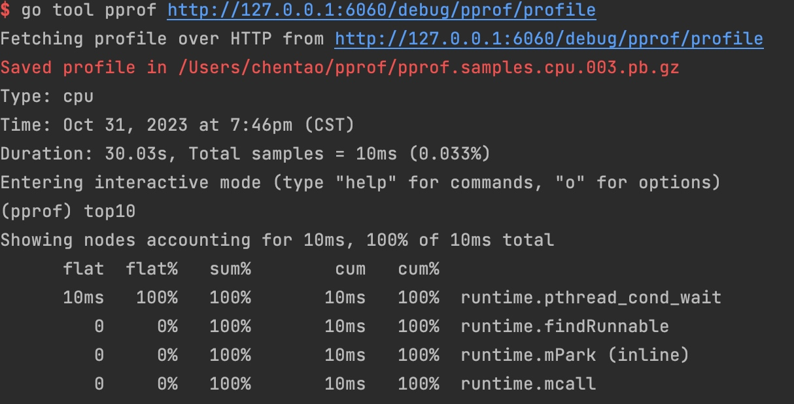

# pprof

pprof是可用于可视化和性能分析的工具。

整个分析的工程分为两步：1. 导出数据 2. 分析数据
## 采样方式
- `runtime/pprof` 采集程序的指定区块的运行数据进行分析
- `net/http/pprof` 基于http server运行，并且可以采集运行时数据进行分析
- `go test` 通过运行测试用例，并执行所需标识进行采集

## 支持什么使用模式
- 报告生成
- 交互式终端
- web界面

## 可以做什么
- CPU 分析：按照一定频率采集所监听的应用程序CPU（含寄存器）的使用情况，可确定应用程序在主动消耗CPU周期是花费时间的位置
- Memory profilling：内存分析，用于监听当前和历史的内存使用情况，以检查内存泄露
- block profilling：阻塞分析，记录 **goroutine**阻塞等待同步（包含定时器通道）的位置，默认不开启，需要调用 `runtime.SetBlockProfileRate` 进行设置
- mutex：互斥锁分析，报告互斥锁的竞争情况，默认不开启，调用`runtime.SetMutexProfileFraction()`进行设置。
- groutine：对当前应用程序正在运行的groutine进行堆栈跟踪和分析。这项功能**实际排查中经常用到**，因为很多问题出现的表象就是groutine暴增

## 导出数据

### 网页
1. 导入pprof包
```go
import "net/http"
import _ "net/http/pprof"
```
2. 在代码运行开始的地方加上
```go
go func() {
   log.Println(http.ListenAndServe(":6060", nil))  
}()
```
接口，可以访问 http://127.0.0.1:6060/debug/pprof 看看

总共9个指标
- allocs：查看过去所有内存分配的样本
- block：查看导致阻塞同步的堆栈跟踪
- cmdline： 当前程序的命令行的完整调用路径。
- goroutine：查看当前所有运行的 goroutines 堆栈跟踪
- heap：查看活动对象的内存分配情况
- mutex：查看导致互斥锁的竞争持有者的堆栈跟踪
- profile： 默认进行 30s 的 CPU Profiling，得到一个分析用的 profile 文件
- threadcreate：查看创建新 OS 线程的堆栈跟踪

再部署环境中，为了网络安全，通常不会直接对外网暴露ppro先关端口，因此会通过`curl`，`wget`等当时进行profile文件的间接拉取。

另外debug的访问方式是有时效性的，在实际场景中，我们需要及时的将当前状态下profile文件存储下来，以便进行二次分析。

### 脚本
我们还可以再代码中把原始数据写到固定文件里。代码很简单，主要分为两类，CPU的profile和其他。
```go
go func() {
    f, _ := os.Create("cpu.pprof")
    defer f.Close()
    _ = pprof.StartCPUProfile(f)
    time.Sleep(1 * time.Minute)
    pprof.StopCPUProfile()
}
```

## 分析数据
现在已经可以打开 http://127.0.0.1:6060/debug/pprof，后可以已经有一个数据文件。我们一CPU指标为例，看一下如何分析。

```
-- 网页分析
go tool pprof http://127.0.0.1:6060/debug/pprof/profile

-- 文件
go tool pprof cpu.pprof 
```


flat：函数自身的运行耗时。
flat%：函数自身在 CPU 运行耗时总比例。
sum%：函数自身累积使用 CPU 总比例。
cum：函数自身及其调用函数的运行总耗时。
cum%：函数自身及其调用函数的运行耗时总比例。
Name：函数名。

### 可视化分析工具 graphviz
需要安装 [graphviz](https://graphviz.org/download/)

mac 执行 `brew install graphviz`安装

启动服务
```
$ go tool pprof -http=:8000 http://127.0.0.1:6060/debug/pprof/profile
$ go tool pprof -http=:8000 cpu.out
$ go tool pprof -http=:8000 pprof.XXX.samples.cpu.001.pb.gz
```


> [go大杀器之性能剖析PProf](https://golang2.eddycjy.com/posts/ch6/01-pprof-1/)

