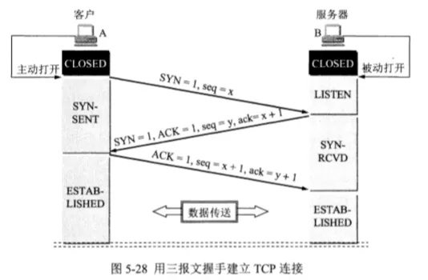
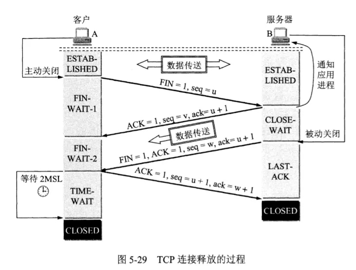

# 三次握手

> tcp是面向连接的、可靠的、基于字节流的传输层协议

三次握手的目的是连接服务器指定端口，建立 TCP 连接，并同步连接双方的**序列号**和**确认号**，交换 TCP 窗口大小信息。在 socket 编程中，客户端执行 connect() 时。将触发三次握手。

第一次握手：
客户端将TCP报文标志位SYN置为1，随机产生一个序号值seq=J，保存在TCP首部的序列号(Sequence Number)字段里，指明客户端打算连接的服务器的端口，并将该数据包发送给服务器端，发送完毕后，客户端进入**SYN_SENT**状态，等待服务器端确认。

第二次握手
服务端接收到SYN=1的请求包，从而知道客户请求建立连接，服务器端将TCP报文标志位SYN和ACK置为1，确认接收序号ack=j+1，并产生一个随机序号值seq=k，将该数据包发送给客户端，自身进入**SYN_RCVD**

第三次握手
客户端接收到确认后，检查ACK是否=1，确认序号是否正确，如果正确则将标志位ACK置为1，ack=k+1，将该数据包发送给服务端，服务端检查ACK=1和ack=k+1，如果正确则连接建立成功，客户端和服务端进入**ESTABLISHED**状态 ，完成3次握手，客户端和服务端就可以传输数据了。

关键词：ack 和 ACK
> 小写的ack代表的是头部的确认号Acknowledge number， 缩写ack，是对上一个包的序号进行确认的号，ack=seq+1。
>
>大写的ACK，则是我们上面说的TCP首部的标志位，用于标志的TCP包是否对上一个包进行了确认操作，如果确认了，则把ACK标志位设置成1。

## 为什么需要三次握手
首先，通讯双方都需要确认自己的发送和接收功能正常，如果只是两次握手，服务端无法确认自己发出的消息客户端是否收到。

假设只进行两次握手就建立连接，如果客户端发送一个建立连接的请求，但是这个请求报文没有消失而是在某个网络节点长时间滞留了，以至于连接释放后才到达server，本来这是一个已经失效的请求，但是服务端会认为是一个新的请求连接，于是向client发送ACK，建立连接。但是对客户端来说它并没有发送连接请求，因此不会理睬，也不会发送数据给server。server会一直等待，造成资源浪费。 

# 四次挥手

## 为什么需要四次挥手
**因为tcp是双全工模式**，客户端和服务端都可以发送数据所以需要四次挥手。
假设FIN请求由客户端发起，服务端接受到后立即返回ACK=1应答，进入**close-wait**状态，在此期间服务端发送数据后，再向客户端发起FIN请求并进入**LAST_ACK**状态，客户端收到FIN=1，ACK=1的请求后，给服务端返回ACK=1的应答，等待2MSL后关闭连接，服务端收到ACK=1的应答也关闭连接

## 为什么要等待2MSL（为什么需要TIME_WAIT）
> MSL 报文段最大生存时间
> RTO 重传超时时间

《unix网络编程》中解释到
> - 优雅的关闭TCP连接，也就是尽量保证被动关闭的一端收到自己发出去的FIN报文的ACK报文
> - 处理延迟的重复报文，这主要是避免使用相同四元组的两个连接，前一个连接的报文干扰后一个连接

1. 保证TCP双全工连接可以可靠关闭

由于IP协议的不可靠性或网络原因，客户端需要等待服务端搜到ACK，关闭连接，如果服务端没有收到，那么会在超时后重新发送FIN，客户端需要重新发送ACK。否则，服务端没有成功关闭连接，导致连接混乱。

2. 保证这次连接的全部数据从网络中消失
如果不等待2MSL，上次连接的发送的数据可能还滞留在网络中，建立新链接后，这些数据会被认为是本次连接的，这些脏数据会导致包混乱。

## 为什么是2MSL，而不是1MSL
TIME_WAIT至少需要持续2MSL时长，这2个MSL中的第一个MSL是为了等自己发出去的最后一个ACK从网络中消失，而第二MSL是为了等在对端收到ACK之前的一刹那可能重传的FIN报文从网络中消失。另外，虽然说维持TIME_WAIT状态一段时间有2个目的，但这段时间具体应该多长主要是为了达成上述第二个目的而设计的。

> https://zhuanlan.zhihu.com/p/108504297
> https://zhuanlan.zhihu.com/p/204988465