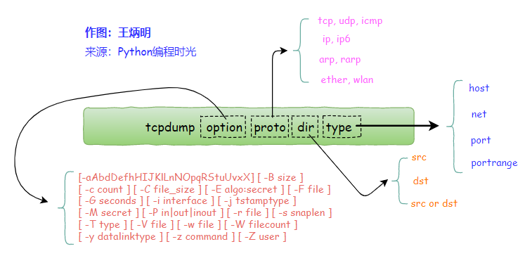

# 知识点
## http
- [三次握手和四次挥手](http/三次握手和四次挥手.md)
- [TCP滑动窗口](http/tcp滑动窗口.md)

## 安全
- [常见的网络攻击](safe/网络安全.md)

## nginx
- [nginx基本配置](nginx/nginx配置.md)
- [nginx负载均衡](nginx/nginx反代理.md)
- [nginx重启关闭](nginx/nginx重启关闭.md)

## MySQL
1. [MyISAM与InnoDB的区别](mysql/MyISAM与InnoDB.md)
2. [mysql事务](mysql/mysql事务.md)
3. [主从同步](mysql/mysql主从复制.md)
4. [mysql索引优化](mysql/mysql索引优化.md)

## clickhouse
1. [clickhouse](clickhouse.md)

## Redis
- [Redis知识点](redis/redis.md)
- [集群模式cluster](redis/redis-cluster.md)
- [大key问题](redis/bigkey和hotkey.md)
- [redis内存淘汰策略](redis/redis内存淘汰策略.md)
- [redis实现分布式锁](redis/redis分布式锁.md)

## 消息队列 kafka RabbitMQ
- [kafka](kafka/Kafka常见面试题.md)
- [rabbit]()
- [最终一致性]()

## 微服务
- [微服务架构]()
- [GRPC负载均衡LoadBalance]()
- [etcd实现服务注册、健康检测、服务发现](https://www.cnblogs.com/FireworksEasyCool/p/12890649.html)

## docker
- [docker与虚拟机VM的区别](https://blog.csdn.net/K_520_W/article/details/111304146) 

## 设计模式
- [Gof](设计模式.md)
## php
1. [垃圾回收机制](PHP/PHP垃圾回收机制.md)
2. [nginx与php之间的通信过程](PHP/nginx与php之间的通信过程.md)
3. [laravel](PHP/laravel知识点.md)

## golang
1. [go常见问题](golang/go细节.md)
2. [垃圾回收机制](golang/go的垃圾回收机制.md)
3. [go的内存分配](golang/go的内存分配.md)
5. [goroutine内存泄露](golang/go内存泄露.md)
6. [go并发控制几种方式](golang/go并发控制.md)
7. [终止goroutine的方式](golang/终止goroutine的方式.md)
8. [goroutine并发原理GPM模型](golang/goroutine.md)
9. [nil](golang/go——nil.md)
10. [无缓冲channel和有缓冲channel的区别](golang/channel.md)
11. [channel 关闭引发的painc](golang/close-channel-painc.md)
12. [八股文](https://juejin.cn/post/7029704699435548679)
13. [性能分析工具pprof](golang/pprof.md)

### 常用包
- [context](golang/context.md)
- [sync并发控制](golang/Sync包.md)
    - WaitGroup 
    - Mutex   排他锁
    - RWMutex 读写锁
    - Once 主groutine的生命周期内只会执行一次
    - signal.flight 并发请求只会执行一次

## 常用命令
### awk 文本分析工具，逐行处理文件中的数据

内置变量
* FS 分隔符，默认是空格
* NR 当前行数，从1开始
* NF 当前记录字段个数
* $0 当前记录
* $1~$n 当前记录第n个字段

示例：
1. 输出用`/`分割`have_save_file.txt`文件，并输出`第3到第5行`中的`$0`整行、`$1`第一行、`$NF`最好一行、`NR`行号
```
awk -F/ 'NR==3,NR==5{print $0,$1,$NF, NR}' have_save_file.txt
``` 

2. 输出行长度大于80的行，以及行号
```
awk 'length($0)>80 {print $0, NR}' have_save_file.txt
```

### sed 一种行编辑器
`-n`：sed会在处理一行文本前，将待处理的文本打印出来，-n参数关闭了这个功
`p`：表示打印，
`$`：表示最好一行
1. 打印文件`have_save_file.txt`的第2到10行
```
sed -n '2,10'p have_save_file.txt
```
1. 匹配有`moshanshan`的行
```
sed -n '/moshanshan'p have_save_file.txt
```

还可以再匹配的行前后进行插入操作，替换匹配的行，删除，批量替换删除

### 抓包工具tcpdump


常见指令
```bash
# 通过host参数对ip过滤
tcpdump host 122.228.200.98

# 限定端口号
tcpdump port 8080 or 80
# 限定端口号范围
tcpdump portrange 8000-8080 
```

> https://www.cnblogs.com/wongbingming/p/13212306.html


# 实战问题分析
## 分表分库后的分页需求
1. 对于统计需求，需要单独提供report服务，对统计维度数据预处理生成；
对于元数据需要，产品层面禁止多维度排序，同时只允许当维度的排序。分页方案，简化处理可以采用通用的下来刷新框架，每次传入偏移量和读取数据的条目

1. join 查询的处理

只能进行拆分，先查询得到id（注意只查id可以利用索引覆盖），如果数据量有限，可以in查询，如果很多，最好走缓存层。

## 按时间范围分表后，怎么通过订单号查询
- 将时间最为生成订单的因子，可以从订单中分析出时间
- 建立订单与时间的关联表

## 跨多表筛选和排序
先在个个表中按筛选条件得到关联key数组
只允许一个排序条件，这样进去排序字段所在表排序即可

## 数据库读写分离，数据不一致
在关注数据一致性的场景中，可以设置直接读取master库。比如通过redis继续记录100ms改变的table，自动路由到master库。

## 最大的挑战&&最有成就的
参与架构设计，数据库的分表分库，通过shopId分库，订单表按时间范围分表，生成的订单需要包含时间因子，便于通过订单号确认分表的hash

## 接口突然变慢的排查思路
业务层面上，接口突然变慢通常是由于依赖的下游导致的，比如redis异常，cache miss。比如慢SQL，in、like、join等查询很容易出现慢查询。如果依赖es搜索引擎，一定要限制关键字的长度，否则可能出现海量的分词，导致崩溃。如果依赖下游服务，也可能是下游的服务超时重试，可以查看相关的日志。

如果大量接口超时，那么可能就是服务器资源的问题了，可以看一下并发情况，cpu占用情况，是否出现资源不足。

## php composer的自动加载的原理？

## http常用的header
host
user-agent
accpet
accpet-language
accpet-enconding
referer
range

## 高内聚低耦合
高内聚即服务、类、函数实现单一职责，不可再分割；低耦合，可以认为是一处需要改动，尽快能较少对其他地方的影响。

典型问题：
1. 到时都是原生sql对数据的操作，没有统一的数据服务层。最好遵循面向接口编程原则，统一提供服务，再实现具体功能类，提高扩展性和健壮性，为以后的扩展提供空间。
2. 服务冗余，存在同样的服务