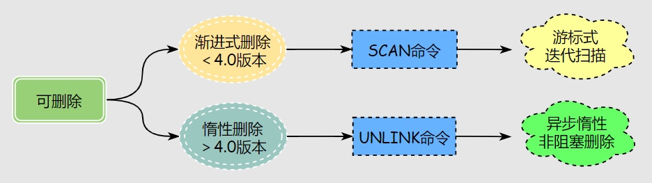

# bigkeys 和 hotkeys

## 查看bigkeys和hotkeys的方法：
##### bigkeys
```
redis-cli --bigkeys

redis-cli --hotkeys
```

##### GUI可视化工具来查看

##### redis-rdb-tools 
使用redis-rdb-tools离线分析工具来扫描RDB持久化文件，虽然实时性略差，但是完全离线对性能无影响


## 什么是bigkey、hotkey
> bigkey，又叫大key，是指redis日常使用过程中，某些key所占内容空间过大。

> hotkey，俗称“热key”，一个key对应在一个redis分片上，当短时间内大量的请求打到该分片上，key被频繁访问，该key就是热key。

## 大key的影响

单线程中请求任务的处理是串行的，前面完不成，后面处理不了，同时也导致分布式架构中**内存数据和CPU的不平衡**

1. **内存占用过高**
2. **性能下降**：大key的操作，都会消耗更多的CPU时间和内存资源，降低系统性能
3. **阻塞其他操作**
4. **网络拥塞**，每次读取大key产生的网络流量较大，多次请求大就可能导致带宽被打满，波及其他服务
5. **主从同步延迟**
6. 数据倾斜

## hotkey的影响
1. **分片服务器瘫痪**，因为cluster的机制，大量请求集中到一个分片，导致改分片瘫痪
2. **造成资产损失**，极端情况下，容易发生边界数据处理不及时，订单场景可能出现资产损失
3. **引发缓存击穿**，如果请求过于集中，redis承载不了，请求会落到数据库，导致数据库服务瘫痪
4. **CPU占用过高**，影响其他服务。

## 删除大key


1. 如果redis版本大于4.0，可以通过 `UNLINK` 命令删除，这是非阻塞删除的命令
2. 如果redis版本大于4.0，则需要通过 `scan` 执行增量迭代扫描，然后判断删除

### 压缩拆分大key
- 当vaule是string时，比较难拆分，则使用序列化、压缩算法将key的大小控制在合理范围内，但是序列化和反序列化都会带来更多时间上的消耗
- 当value是string，压缩之后仍然是大key，则需要进行拆分，一个大key分为不同的部分，记录每个部分的key，使用`multiget`等操作实现事务读取
- 当value是list/set等集合类型时，根据预估的数据规模来进行分片，不同的元素计算后分到不同的片


---
参考资料
> https://zhuanlan.zhihu.com/p/601382577
> https://zhuanlan.zhihu.com/p/622474134