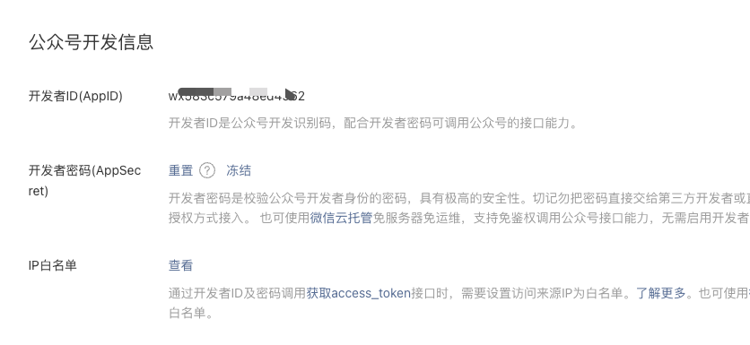
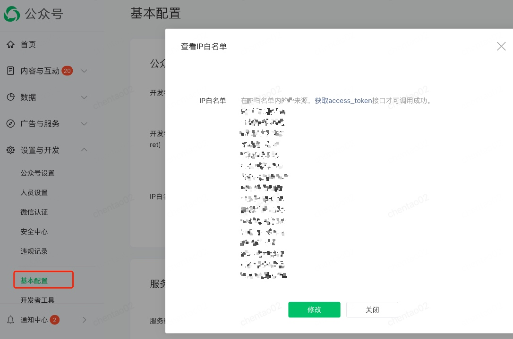
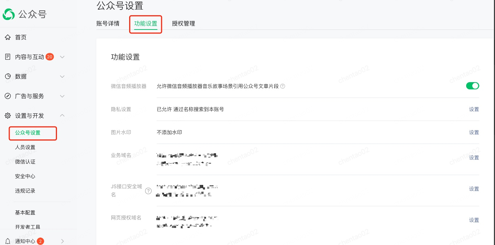
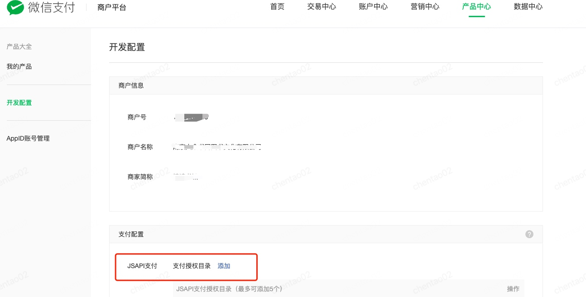
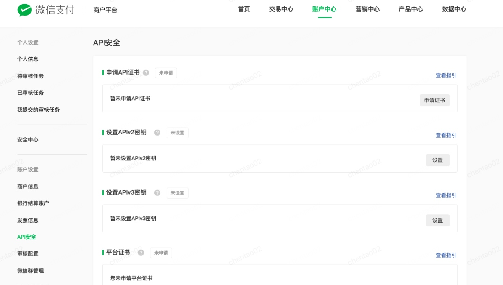
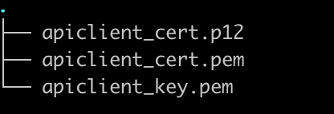
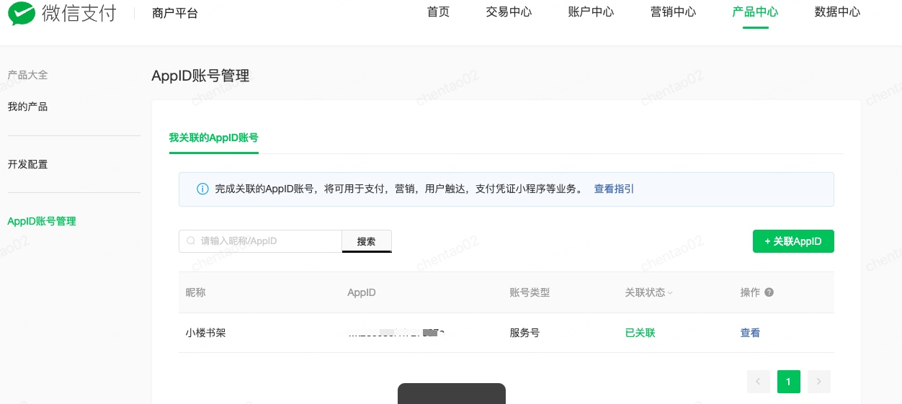

# 微信公众号配置指南

## 公众号配置
### 1. 获取开发者ID（AppID）和开发者密码（AppSecret）
> 查找路径： 设置与开发 → 基本设置

### 2. 设置IP白名单
> 查找路径： 设置与开发 → 基本设置

### 3. 配置网页授权目录
> 设置与开发 → 公众号设置 → 功能设置

注意：
1. 只有服务号可以配置
2. 域名不含**http(s)**
3. 网页授权域名只能配置2个

### 4. 配置JS接口安全域名 和 业务安全域名

## 商户号配置
### 支付授权目录
> 产品中心 → 开发配置 → 支付配置 → jsapi支付授权目录

### 配置API安全证书和秘钥
> 账户中心 → API安全

- 按指引生成证书和APIv3秘钥 

- 按指引生成证书后解压会得到3个文件，查看生成的证书秘钥

需要用到的重要商户号信息包括：
- merchant_no                 商户号ID
- merchant_cert_no            API安全 -> 管理证书  API证书编号
- merchant_cert_private_key   API证书private_key
- merchant_apiv3_secret       APIv3秘钥
- weixin_cert_no              API安全 -> 平台证书管理

### 关联APPID账号，对应的APP需要确认绑定

